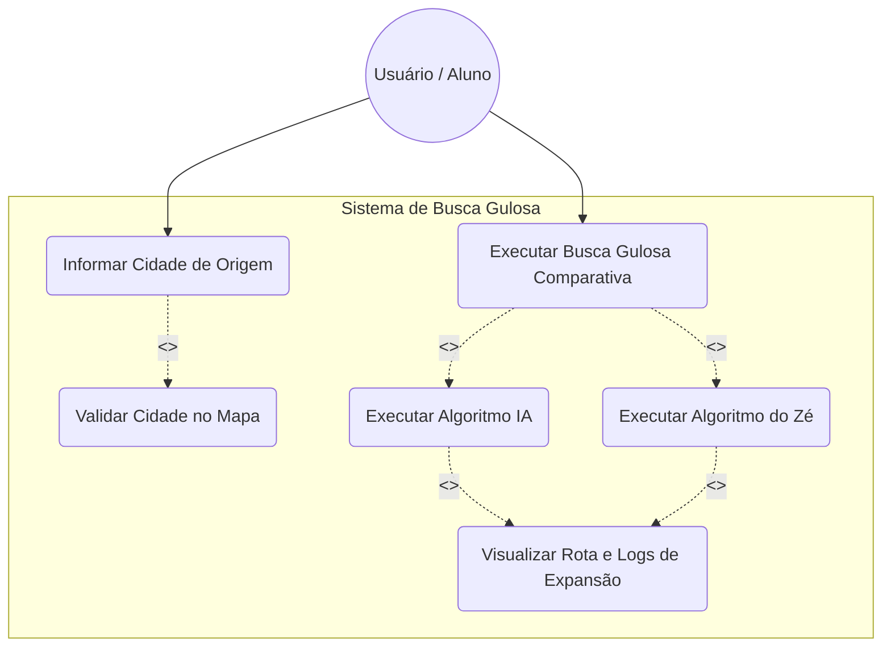
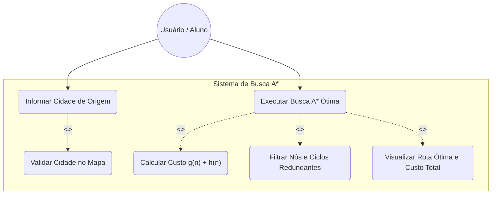
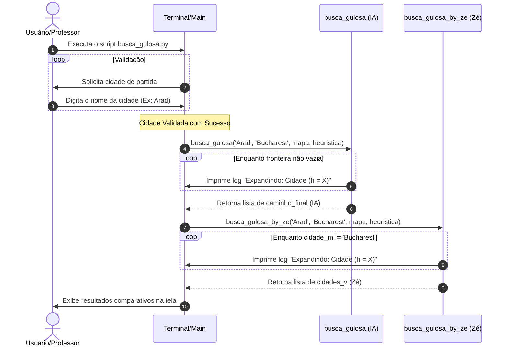
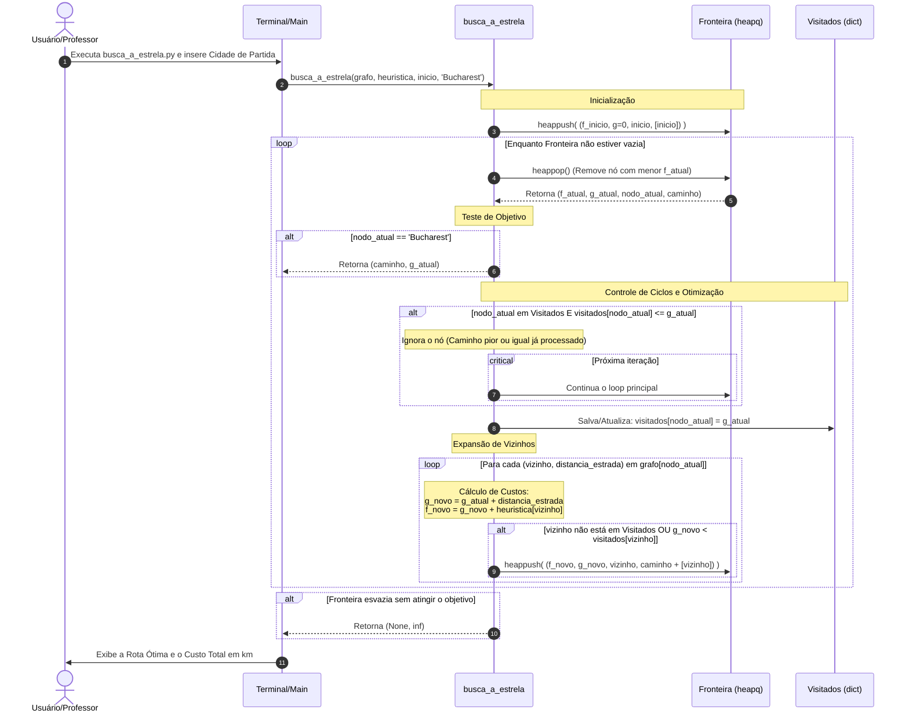
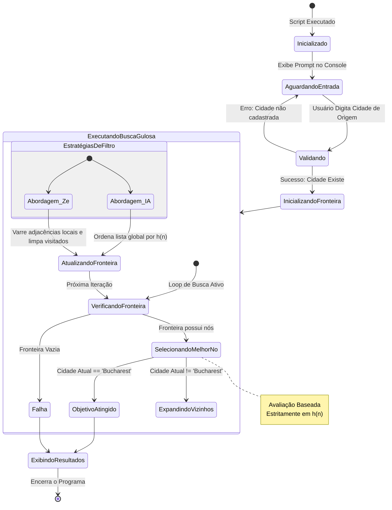
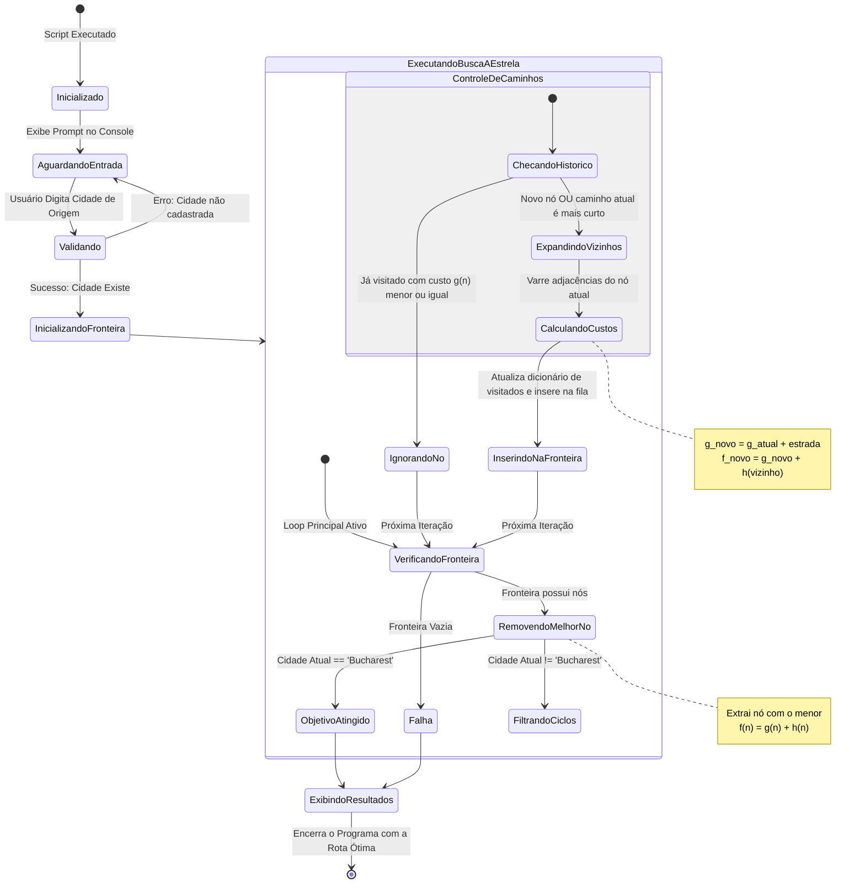

# Introdução à Inteligencia Artificial
Repositório dos trabalhos da matéria de introdução à Inteligência Artificial - Professor Arnaldo - Fatec São Carlos


# Algoritmos de Busca no Mapa da Romênia (A* e Busca Gulosa)

Este repositório contém as implementações e análises comparativas de algoritmos de busca informada aplicados ao clássico problema do **Mapa da Romênia**, baseado no Capítulo 3 do livro clássico *“Inteligência Artificial: Uma Abordagem Moderna”* de Stuart Russell e Peter Norvig.

O objetivo do projeto é determinar caminhos eficientes partindo de qualquer cidade válida dentro do grafo e chegando obrigatoriamente à capital, **Bucareste (Bucharest)**, utilizando abordagens heurísticas distintas.

---

## 🛠️ 1 - Descrição do Projeto

O sistema é composto por dois scripts executáveis em ambiente de terminal de linha de comando:
1.1 **`busca_a_estrela.py`**: Implementa o algoritmo de busca ótima **A***. Ele utiliza uma fila de prioridade para balancear o custo real já percorrido do caminho ($g(n)$) com a estimativa heurística da distância restante em linha reta ($h(n)$), resultando na função de avaliação estável $f(n) = g(n) + h(n)$.
   
1.2 **`busca_gulosa.py`**: Implementa e confronta duas perspectivas lógicas distintas do algoritmo **Busca Gulosa (Greedy Best-First Search)**:
   * **Abordagem IA**: Implementação padrão estruturada através de uma fronteira ordenada iterativamente que simula uma árvore ou grafo de estados com histórico global de nós visitados.
   * **Abordagem "By Zé"**: Uma rotina de aprendizado com foco puramente procedural e didático desenvolvida pelo programador José Ferrazza. Ela foca no menor valor local de heurística e remove manualmente nós do conjunto de vizinhos dinâmicos baseando-se estritamente nas adjacências imediatas da última cidade visitada.

---

## 📋 2 - Requisitos Funcionais (RF)

* **RF01 - Entrada Interativa de Origem**: O sistema deve permitir que o operador insira via console (`input`) o nome da cidade de partida da busca.
* **RF02 - Validação do Ponto de Partida**: O sistema deve checar obrigatoriamente se a cidade digitada consta na base de dados (heurística/grafo). Se for inválida, exibirá um alerta e repetirá a entrada em loop até o recebimento de um dado válido.
* **RF03 - Destino Imutável**: O alvo final e critério de parada padrão de sucesso para ambos os algoritmos deve ser fixado estritamente na cidade de **'Bucharest'**.
* **RF04 - Cálculo do Caminho Ótimo pelo A***: O script `busca_a_estrela.py` deve processar a malha do mapa, computar a menor rota total possível e imprimir na tela a sequência exata de cidades adjacentes e o custo numérico cumulativo em quilômetros.
* **RF05 - Execução Comparativa na Busca Gulosa**: O script `busca_gulosa.py` deve processar simultaneamente a entrada do usuário através das duas funções internas (`busca_gulosa` e `busca_gulosa_by_ze`), exibindo as rotas geradas por ambas para fins de contraste pedagógico.
* **RF06 - Logs de Expansão em Tempo Real**: Ambos os scripts devem documentar no terminal a sequência de nós expandidos e seus respectivos pesos heurísticos ($h$) no exato momento da operação de remoção da fronteira ou seleção local.

---

## 🛡️ 3 - Requisitos Não Funcionais (RNF)

* **RNF01 - Desempenho**: O cálculo do A* e da Busca Gulosa para a malha de dados proposta deve ser concluído e impresso em tempo de execução inferior a 100 milissegundos após a validação da entrada.
* **RNF02 - Segurança**: O sistema deve rodar isolado em escopo de usuário local, sem necessidade de privilégios de administrador (`root`/`sudo`) e sem comunicação externa de rede.
* **RNF03 - Usabilidade**: A interação com o console deve ser simples e autoexplicativa, utilizando menus em caixas de texto ASCII formatadas para melhorar o foco visual do usuário.
* **RNF04 - Disponibilidade**: Os scripts devem operar de maneira totalmente offline (standalone), garantindo 100% de disponibilidade operacional independente de servidores externos.
* **RNF05 - Escalabilidade**: A estrutura de dados baseada em Listas de Adjacência (`dict` contendo `list` de `tuples`) deve permitir o escalonamento e inserção de novas cidades e custos rodoviários sem necessidade de reconfiguração lógica das funções de busca.
* **RNF06 - Manutenabilidade**: O código-fonte deve conter comentários claros separando as regras de negócio de IA das estruturas acessórias, facilitando refatorações futuras ou uso como material didático.
* **RNF07 - Confiabilidade**: O algoritmo A* deve ser matematicamente garantido como completo e ótimo devido à natureza admissível e consistente da tabela de heurísticas fornecida (distância em linha reta).
* **RNF08 - Compatibilidade**: Os arquivos do projeto devem ser compatíveis e interpretados nativamente em qualquer ambiente operacional que possua suporte ao **Python 3.6 ou superior**, utilizando apenas módulos nativos (como o `heapq`).

---

## 📊 4 - Diagramas do Sistema

### 4.1 - Diagrama de Casos de Uso (UML)
O diagrama de caso de uso mapeia como o usuário interage com o sistema para selecionar uma cidade e visualizar as rotas informadas, destacando a execução comparativa das duas funções na busca gulosa


O diagrama de caso de uso da busca A* mapeia as interações do operador com o sistema para definir o ponto de partida e visualizar a rota ótima calculada através da função de avaliação combinada $f(n) = g(n) + h(n)



### 4.2 - Diagrama de Sequencia
O diagrama de sequência da busca gulosa ilustra o fluxo de mensagens entre o terminal e as funções de IA e do "Zé", mostrando o rastreamento e a ordenação dos nós baseados estritamente no menor valor da heurística local até atingir o objetivo.


O diagrama de sequência da busca A* ilustra o fluxo de controle e ordenação dos nós em uma fila de prioridade, calculando recursivamente a função de avaliação $f(n) = g(n) + h(n)$ e descartando rotas redundantes até retornar o caminho de custo mínimo


### 4.3 - Diagrama de Estado
O diagrama de estado da busca gulosa, ilustra a transição de passos do sistema conforme ele escolhe as cidades e expande seus vizinhos baseando-se estritamente no menor valor da heurística local até atingir o objetivo.



O diagrama de estado da busca A*, ilustra a transição de passos do sistema conforme ele seleciona cidades através da função de avaliação combinada $f(n) = g(n) + h(n)$ e filtra rotas redundantes até encontrar o caminho ótimo.


## 🚀 5 - Instruções de Uso - Busca Gulosa

Este tópico orienta a execução e a análise didática do script `busca_gulosa.py`. O programa foi projetado para demonstrar o comportamento do algoritmo de Busca Gulosa através de duas abordagens distintas de código enfrentadas no mesmo cenário (Mapa da Romênia).

### 5.1 - Pré-requisitos

Antes de iniciar, certifique-se de que cumpre os seguintes requisitos no seu ambiente de desenvolvimento:
* **Interpretador**: Python instalado na versão **3.6 ou superior**.
* **Dependências**: Nenhuma. O script utiliza apenas recursos e tipos primitivos nativos da linguagem Python (`instanciações de tipos de dados básicos`, `loops` e `sets`).
* **Arquivos**: O arquivo `busca_gulosa.py` deve estar presente na pasta atual do seu terminal.

### 5.2 - Como Executar

1. Abra o terminal de comandos do seu sistema operacional (Prompt de Comando, PowerShell, Terminal do Linux/macOS ou o terminal integrado do VS Code).
2. Navegue até o diretório onde o arquivo `busca_gulosa.py` está guardado:
   ```bash
   cd /caminho/para/o/seu/repositorio
   ```
3. Execute o interpretador Python apontando para o script:
   ```bash
   python busca_gulosa.py
   ```

### 5.3 - Interação com o Programa
Assim que o script for iniciado, ele criará uma interface textual interativa no console. Siga os passos abaixo:

1. Definição da Cidade de Origem
O programa exibirá uma caixa de texto solicitando o ponto de partida. Introduza o nome de uma cidade presente no Mapa da Romênia (utilize a grafia com a primeira letra maiúscula, conforme o livro de IA).

Exemplo de Entrada Válida: Arad

Validação de Erro: Se digitar um nome incorreto ou uma cidade que não pertence ao mapa (ex: Lisboa), o sistema exibirá uma mensagem de alerta e bloqueará a execução em loop até que uma cidade válida seja fornecida.
```text
┌──────────────────────────────────────────────┐
│                Busca Gulosa                  │
└──────────────────────────────────────────────┘
A partir de qual cidade deseja partir?
Lisboa
A cidade Lisboa não existe. Digite outra cidade.

A partir de qual cidade deseja partir?
Arad
```
2. Análise dos Resultados Gerados
Após receber uma entrada válida, o script executa automaticamente as duas funções internas e imprime os logs de expansão de nós em tempo real.
```text
────────────────────────────────────────────────
--> Iniciando Busca Gulosa de Arad para Bucharest
────────────────────────────────────────────────

┌──────────────────────────────────────────────┐
│                   Resultado                  │
└──────────────────────────────────────────────┘

────────────────────────────────────────────────
--> Resultado usando o algoritmo feito pela IA
────────────────────────────────────────────────
Expandindo: Arad (h = 366)
Expandindo: Sibiu (h = 253)
Expandindo: Fagaras (h = 176)
Expandindo: Bucharest (h = 0)

Caminho encontrado (Dev by IA): Arad -> Sibiu -> Fagaras -> Bucharest

────────────────────────────────────────────────
--> Resultado usando o algoritmo feito pelo Zé
────────────────────────────────────────────────
Expandindo: Arad (h = 366)
Expandindo: Sibiu (h = 253)
Expandindo: Fagaras (h = 176)
Expandindo: Bucharest (h = 0)

Caminho encontrado (Dev by Zé): Arad -> Sibiu -> Fagaras -> Bucharest
```

## 🚀 6 - Instruções de Uso - Busca A*

Este documento orienta a execução e a análise didática do script `busca_a_estrela.py`. O programa foi projetado para demonstrar o comportamento do algoritmo de Busca A* através de uma abordagem de otimização que calcula o caminho de custo mínimo real no cenário do Mapa da Romênia.

## 6.1 - Pré-requisitos

Antes de iniciar, certifique-se de que cumpre os seguintes requisitos no seu ambiente de desenvolvimento:
* **Interpretador**: Python instalado na versão **3.6 ou superior**.
* **Dependências**: Nenhuma. O script utiliza bibliotecas nativas do Python, destacando-se o módulo `heapq` para gerenciar a fila de prioridades de forma eficiente.
* **Arquivos**: O arquivo `busca_a_estrela.py` deve estar presente na pasta atual do seu terminal.

## 6.2 - Como Executar

1. Abra o terminal de comandos do seu sistema operacional (Prompt de Comando, PowerShell, Terminal do Linux/macOS ou o terminal integrado do VS Code).
2. Navegue até o diretório onde o arquivo `busca_a_estrela.py` está guardado:
   ```bash
   cd /caminho/para/o/seu/repositorio
   ```
3. Execute o interpretador Python apontando para o script:
   ```bash
   python busca_a_estrela.py
   ```
## 6.3 - Interação com o Programa
Assim que o script for iniciado, ele criará uma interface textual interativa no console. Siga os passos abaixo:

1. Definição da Cidade de Origem
O programa exibirá uma caixa de texto solicitando o ponto de partida. Introduza o nome de uma cidade presente no Mapa da Romênia (utilize a grafia com a primeira letra maiúscula, conforme o livro de IA).

Exemplo de Entrada Válida: Arad

Validação de Erro: Se digitar um nome incorreto ou uma cidade que não pertence ao mapa (ex: Lisboa), o sistema exibirá uma mensagem de alerta e bloqueará a execução em loop até que uma cidade válida seja fornecida.
```text
┌──────────────────────────────────────────────┐
│                  Busca A*                    │
└──────────────────────────────────────────────┘
A partir de qual cidade deseja partir?
Lisboa
A cidade Lisboa não existe. Digite outra cidade.

A partir de qual cidade deseja partir?
Arad
```
2. Análise dos Resultados Gerados
Após receber uma entrada válida, o script executa automaticamente a busca e imprime os logs de expansão de nós em tempo real, calculando os custos parciais e totais.
```text
────────────────────────────────────────────────
--> Iniciando Busca A* de Arad para Bucharest
────────────────────────────────────────────────

┌──────────────────────────────────────────────┐
│                   Resultado                  │
└──────────────────────────────────────────────┘

Expandindo: Arad (f = 366, g = 0, h = 366)
Expandindo: Sibiu (f = 393, g = 140, h = 253)
Expandindo: Rimnicu Vilcea (f = 413, g = 220, h = 193)
Expandindo: Pitesti (f = 417, g = 317, h = 100)
Expandindo: Bucharest (f = 418, g = 418, h = 0)

Caminho ótimo encontrado: Arad -> Sibiu -> Rimnicu Vilcea -> Pitesti -> Bucharest
Custo total do caminho: 418 km
```
